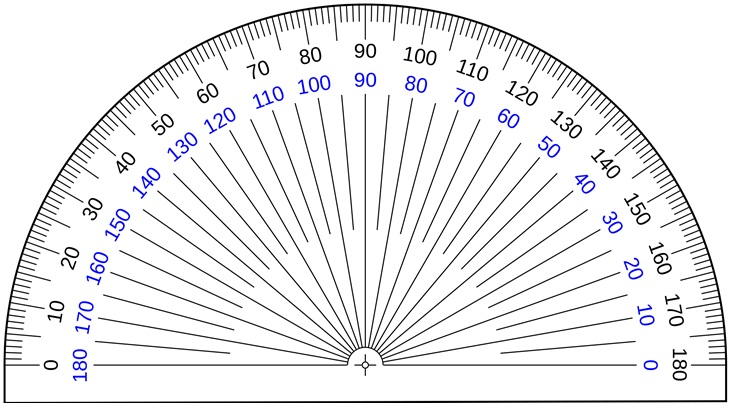
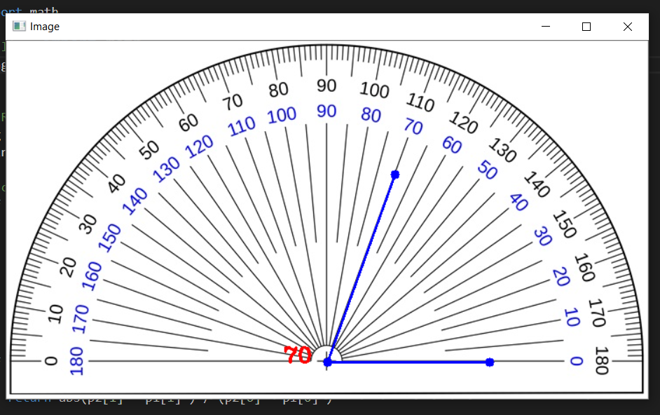

# OpenCV_Projects
### This is my 1st OpenCV Project 
#### I have made a Simple Angle Finder project , which takes any image as input as finds the angle between the 3 selected points using mouse !
#### I have added some features like,  you can earse the points if you have misplaced it and also will find only if 3 points are selected !

## Example - Image 1

## Example Output Image after finding the angle 

### Do give the Repo a Star if you liked it 
### Thank you 
### MANISH SHARMA
